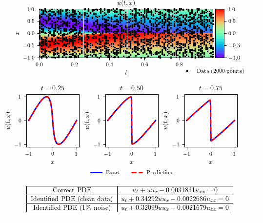

# Burgers equation - Continuous time inference



## Summary

- Total training time: $1.916707 \times 10^2$ seconds
- Total number of iterations: $4.027000 \times 10^3$
- $\text{L}_2$: $1.328988 \times 10^{-3}$            


## Running Scripts


```bash
make all
```

or

```bash
make run_Burgers_ctid_main
```

and then 

```bash
make run_Burgers_ctid_plots
```

to clean generated files:

```bash
make clean
```