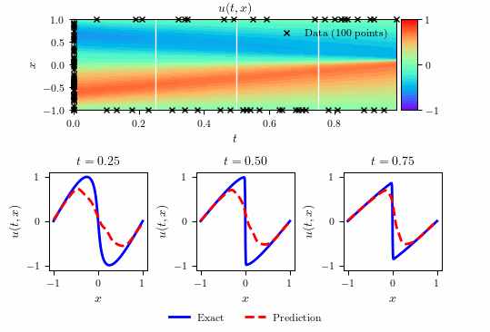

# Burgers equation - Continuous time inference



## Summary 

- Total training time: $2.361567 \times 10^{2}$ seconds
- Total number of iterations: $5,097$
- $\text{L}_{2}$: $3.002951 \times 10^{-3}$            

### Systematic study summary

**Error Table 1**

| $N_{u}$ / $N_{f}$ | 2000                 | 4000                 | 6000                 | 7000                 | 8000                 | 10000                |
|-------------------|----------------------|----------------------|----------------------|----------------------|----------------------|----------------------|
| 20                | $2.89 \times 10^{-1}$| $1.06 \times 10^{-1}$| $2.88 \times 10^{-1}$| $7.79 \times 10^{-2}$| $3.62 \times 10^{-1}$| $2.89 \times 10^{-1}$|
| 40                | $7.99 \times 10^{-3}$| $1.55 \times 10^{-1}$| $5.83 \times 10^{-1}$| $1.07 \times 10^{-2}$| $2.13 \times 10^{-3}$| $4.19 \times 10^{-3}$|
| 60                | $2.50 \times 10^{-1}$| $8.95 \times 10^{-2}$| $1.07 \times 10^{-1}$| $1.77 \times 10^{-3}$| $3.75 \times 10^{-3}$| $2.48 \times 10^{-3}$|
| 80                | $2.33 \times 10^{-1}$| $2.91 \times 10^{-3}$| $2.21 \times 10^{-3}$| $9.31 \times 10^{-4}$| $2.56 \times 10^{-3}$| $9.11 \times 10^{-4}$|
| 100               | $6.51 \times 10^{-3}$| $8.42 \times 10^{-3}$| $9.57 \times 10^{-4}$| $7.16 \times 10^{-3}$| $6.91 \times 10^{-4}$| $1.22 \times 10^{-3}$|
| 120               | $1.48 \times 10^{-2}$| $1.26 \times 10^{-2}$| $7.68 \times 10^{-4}$| $2.25 \times 10^{-3}$| $9.84 \times 10^{-4}$| $1.24 \times 10^{-3}$|


**Error Table 2**

| Layers / Neurons | 10                  | 20                  | 40                  |
|------------------|---------------------|---------------------|---------------------|
| 2                | $1.59 \times 10^{-1}$ | $1.91 \times 10^{-2}$ | $2.81 \times 10^{-2}$ |
| 4                | $7.64 \times 10^{-3}$ | $1.39 \times 10^{-3}$ | $6.32 \times 10^{-4}$ |
| 6                | $2.01 \times 10^{-3}$ | $3.16 \times 10^{-3}$ | $1.14 \times 10^{-3}$ |
| 8                | $1.91 \times 10^{-3}$ | $7.10 \times 10^{-4}$ | $9.21 \times 10^{-4}$ |


## Running Scripts


**Run the scripts individually:**

```bash
make run_Burgers_ctin_main
```

```bash
make run_Burgers_ctin_plots
```

```bash
make run_Burgers_ctin_main_systematic
```

**Run all scripts in sequence:**

```bash
make all
```
