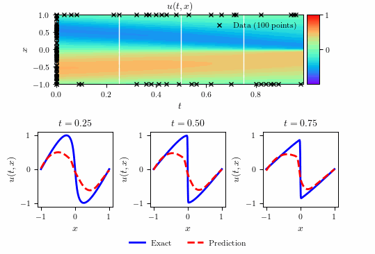

# Burgers equation time inference



## Summary

- Total training time: $1.951159 \times 10^2$ seconds
- Total number of iterations: $4.689000 \times 10^3$
- $\text{L}_2$: $9.162299 \times 10^{-4}$            


## Running Scripts


```bash
make all
```

or

```bash
make run_Burgers_ti_main
```

and then 


```bash
make run_Burgers_ti_plots
```

to clean generated files:

```bash
make clean
```