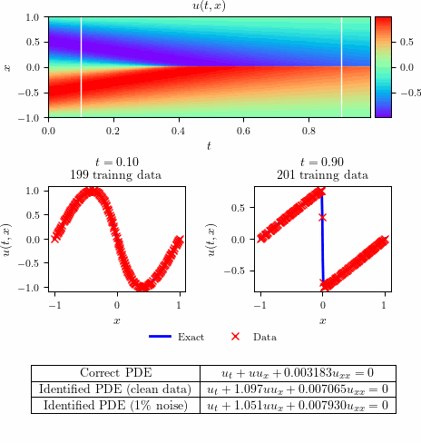

# Burgers equation - Continuous time inference



## Summary

### Clean data

- Total training time: $5.032212 \times 10^{2}$ seconds
- Total number of iterations: $14,083$
- Error in estimating $\lambda_{1}$: $1.776218$ $\times$ $10^{-3}$ %
- Error in estimating $\lambda_{2}$: $1.386773$ $\times$ $10^{-1}$ %

### Noisy data

- Total training time: $1.016188 \times 10^{2}$ seconds
- Total number of iterations: $3,220$  
- Error in estimating $\lambda_{1}$: $6.062984$ $\times$ $10^{-2}$ %
- Error in estimating $\lambda_{2}$: $3.716909$ $\times$ $10^{-1}$ %

## Systematic study

**Table B.8**

$\lambda_{1}$ 

| $\Delta t$ / Noise   | 0 %  | 1 %  | 5 % | 10 % |
|---|---|---|---|---|
| 0.2 | 0.005 | 0.280 | 0.436 | 2.361 |
| 0.4 | 0.001 | 0.270 | 1.527 | 8.529 |
| 0.6 | 0.003 | 0.202 | 0.943 | 4.794 |
| 0.8 | 0.002 | 0.131 | 0.152 | 0.645 |

$\lambda_{2}$ 

| $\Delta t$ / Noise    |  0 %  | 1 %  | 5 % | 10 %   |
|---|-------|-------|-------|-------|
| 0.2 | 0.131 | 14.683 | 12.680 | 80.280 |
| 0.4 | 0.330 | 6.296  | 1.456  | 29.968 |
| 0.6 | 0.094 | 0.922  | 8.020  | 17.997 |
| 0.8 | 0.021 | 1.664  | 13.398 | 7.086  |

**Table B.9**

$\lambda_{1}$ 

| Layers / Neurons  | 10  | 25  | 50  |
|---|---|---|---|
|1| 0.313 | 0.040 | 0.106 |
|2| 0.001 | 0.004 | 0.004 |
|3| 0.046 | 0.004 | 0.002 |
|4| 0.036 | 0.005 | 0.003 |

$\lambda_{2}$ 

|  Layers / Neurons     |  10     |   25    |  50     |
|-------|-------|-------|-------|
|1| 18.681 | 1.702 | 17.513 |
|2| 1.205  | 0.007 | 0.069  |
|3| 2.127  | 0.078 | 0.043  |
|4| 8.569  | 0.526 | 0.204  |


## Running Scripts

**Run the scripts individually:**

```bash
make run_Burgers_dtid_main
```

```bash
make run_Burgers_dtid_plots
```

```bash
make run_Burgers_dtid_main_systematic
```

**Run all scripts in sequence:**

```bash
make all
```