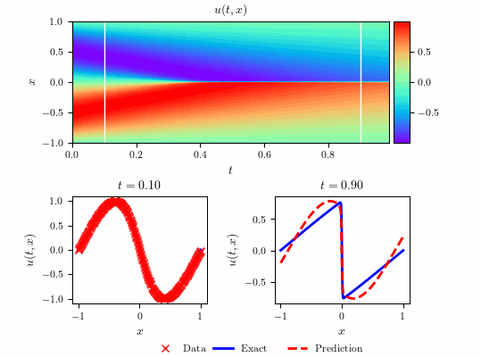

# Burgers equation - Discrete time inference 



## Summary

- Total training time: $5.083700 \times 10^{2}$ seconds
- Total number of iterations: $17,661$
- $\text{L}_{2}$: $7.933333 \times 10^{-2}$            

## Systematic study


**Table A.3**

| Layers / Neurons | 10 | 25 | 50 |  
|--|-----------------------|-----------------------|-----------------------|
| 1 | $6.47 \times 10^{-4}$ | $1.63 \times 10^{-3}$ | $1.30 \times 10^{-3}$ |
| 2 | $7.87 \times 10^{-4}$ | $4.23 \times 10^{-4}$ | $4.42 \times 10^{-2}$ |
| 3 | $5.22 \times 10^{-2}$ | $3.14 \times 10^{-4}$ | $4.08 \times 10^{-2}$ |

**Table A.4**

| q / $\Delta t$ |  0.2    |    0.4          |      0.6      |  0.8        |
|--|-----------------------|-----------------------|-----------------------|-----------------------|
| 1 | $1.03 \times 10^{-3}$ | $5.80 \times 10^{-4}$ | $7.59 \times 10^{-4}$ | $8.13 \times 10^{-4}$ |
| 2 | $2.45 \times 10^{-4}$ | $4.96 \times 10^{-4}$ | $8.24 \times 10^{-3}$ | $2.27 \times 10^{-4}$ |
| 4 | $5.73 \times 10^{-4}$ | $9.51 \times 10^{-4}$ | $5.28 \times 10^{-4}$ | $4.58 \times 10^{-4}$ |
| 8 | $3.42 \times 10^{-4}$ | $8.53 \times 10^{-4}$ | $4.40 \times 10^{-4}$ | $4.47 \times 10^{-4}$ |
| 16 | $3.02 \times 10^{-2}$ | $1.64 \times 10^{-3}$ | $3.91 \times 10^{-2}$ | $8.60 \times 10^{-2}$ |
| 32 | $8.72 \times 10^{-3}$ | $1.64 \times 10^{-1}$ | $2.62 \times 10^{-4}$ | $3.19 \times 10^{-4}$ |
| 64 | $5.75 \times 10^{-4}$ | $9.71 \times 10^{-2}$ | $2.14 \times 10^{-4}$ | $2.09 \times 10^{-1}$ |
| 100 | $4.96 \times 10^{-4}$ | $4.24 \times 10^{-4}$ | $8.81 \times 10^{-4}$ | $5.19 \times 10^{-4}$ |
| 500 | $6.83 \times 10^{-4}$ | $6.12 \times 10^{-4}$ | $1.33 \times 10^{-3}$ | $1.08 \times 10^{-3}$ |


## Running Scripts

**Run the scripts individually:**

```bash
make run_Burgers_dtin_main
```


```bash
make run_Burgers_dtin_plots
```


```bash
make run_Burgers_dtin_main_systematic
```

**Run all scripts in sequence:**

```bash
make all
```