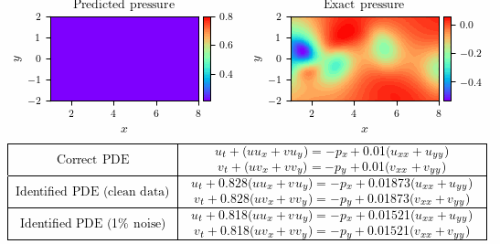

# Navier–Stokes equation

## Summary

### Clean data

- Total training time: $3.68672 \times 10^3$ seconds
- Total number of iterations: $3.7246 \times 10^4$
- Error in estimating $\lambda_{1}$: $0.27$%
- Error in estimating $\lambda_{2}$: $6.75$%

### Noisy data

- Total training time: $4.19767 \times 10^3$ seconds
- Total number of iterations: $4.2706 \times 10^4$
- Error in estimating $\lambda_{1}$: $0.34$%
- Error in estimating $\lambda_{2}$: $7.67$%
