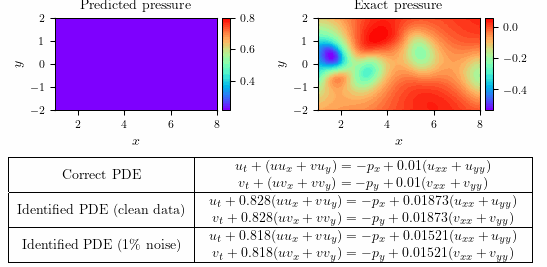

# Navier–Stokes equation - Discrete time inference



## Summary

### Clean data

- Total training time: $26.440$ $\times$ $10^{3}$ seconds
- Total number of iterations: $231,424$ 
- Error in estimating $\lambda_{1}$: $0.007$ %
- Error in estimating $\lambda_{2}$: $1.864$ %

### Noisy data

- Total training time: $26.236$ $\times$ $10^{3}$ seconds
- Total number of iterations: $228,766$
- Error in estimating $\lambda_{1}$: $0.029$ %
- Error in estimating $\lambda_{2}$: $3.290$ %

## Running Navier–Stokes equation Scripts


```bash
make all
```

or

```bash
make run_NS_clean_main
```

```bash
make run_NS_noisy_main
```


```bash
make run_NS_plots
```
 