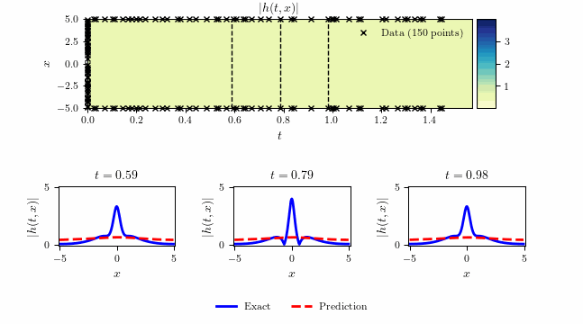

# Schrodinger equation - Continuous time inference



## Summary

- Total training time: $5.652 \times 10^2$ seconds
- Total number of iterations: $20,968$
- $\text{L}_2$: $1.307 \times 10^{-3}$            

## Running Scripts


```bash
make all
```

or

```bash
make run_Schrodinger_main
```

```bash
make run_Schrodinger_plots
```

