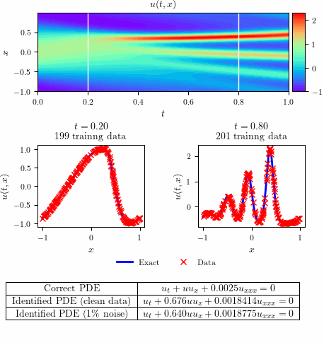

# Korteweg–de Vries equation - Discrete time identification

 

## Summary

### Clean data

- Total training time: $1.53754$ $\times$ $10^{3}$ seconds
- Total number of iterations: $61,348$
- Error in estimating $\lambda_{1}$: $0.004$ $\%$
- Error in estimating $\lambda_{2}$: $0.005$ $\%$

### Noisy data

- Total training time: $1.7998 \times 10^{3}$ seconds
- Total number of iterations: $53,235$
- Error in estimating $\lambda_{1}$: $0.119$ $\%$
- Error in estimating $\lambda_{2}$: $0.048$ $\%$

## Running Korteweg–de Vries equation Scripts


```bash
make all
```

or

```bash
make run_KdV_clean_main
```

```bash
make run_KdV_noisy_main
```


```bash
make run_KdV_plots
```
