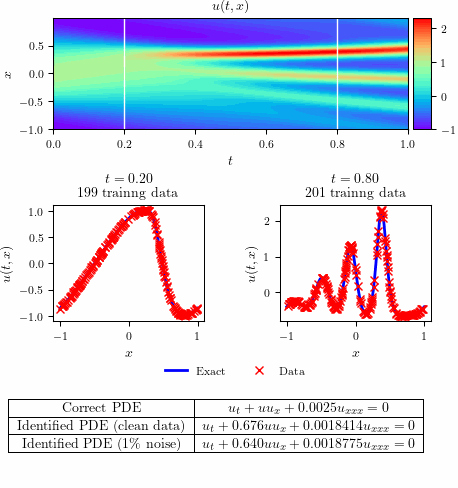

# Korteweg–de Vries equation

 

## Summary

### Clean data

- Total training time: $1.53754 \times 10^3$ seconds
- Total number of iterations: $61.348 \times 10^3$
- Error in estimating $\lambda_{1}$: 0.004%
- Error in estimating $\lambda_{2}$: 0.005%

### Noisy data

- Total training time: $1.7998 \times 10^3$ seconds
- Total number of iterations: $53.235 \times 10^3$
- Error in estimating $\lambda_{1}$: 0.119%
- Error in estimating $\lambda_{2}$: 0.048%

## Running Korteweg–de Vries equation Scripts


```bash
make all
```

or

```bash
make run_KdV_clean_main
```

```bash
make run_KdV_noisy_main
```

and then 


```bash
make run_KdV_plots
```

to clean generated files:

```bash
make clean
```