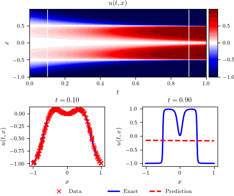

# Allen–Cahn equation - Discrete time inference



## Summary
 
- Total training time: $5.652$ $\times$ $10^{2}$ seconds
- Total number of iterations: $20,968$
- $\mathbb{L}_2$: $1.307$ $\times$ $10^{-3}$

## Running Allen–Cahn Scripts


 **Run the scripts individually:**


```bash
make run_AC_main
```
 
```bash
make run_AC_plots
```

**Run all scripts in sequence:**

```bash
make all
```
